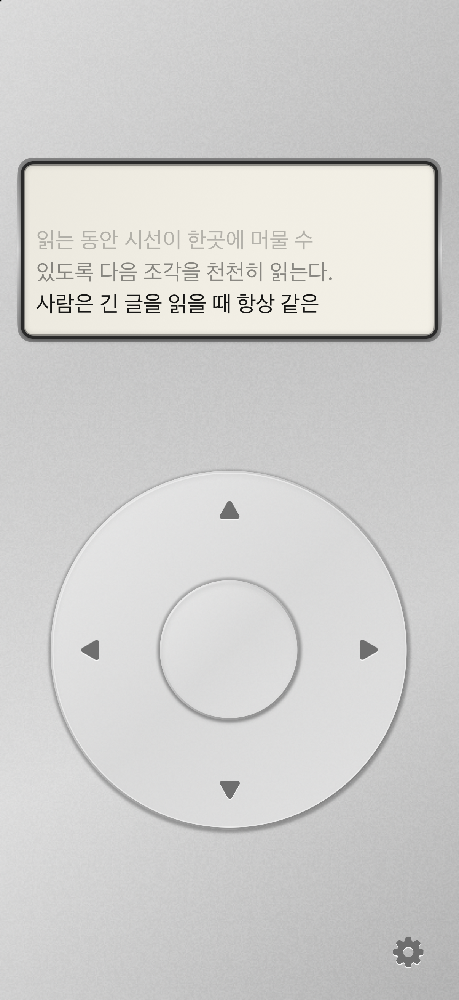

# Pocket Progressive Reader

Native iPhone behavioral prototype of a physical, fixed-focus reader. The home is a silver iPod Classic inspired instrument: inset display, ivory directional wheel, one settings entry. Settings use a plain iOS Form.

## Product context

Read [HANDOFF.md](HANDOFF.md) first. Its historical desktop lab and userscript are preserved as references. Current owner decisions supersede its PWA suggestion: SwiftUI, home + settings only, no title/library/session dashboard. The approved visual target is [docs/design/approved-home.png](docs/design/approved-home.png).

## Build

- Xcode with an iOS simulator; minimum iOS 17.
- Open `PocketReader.xcodeproj`, choose the `PocketReader` scheme and an iPhone simulator, then Run.
- Project generation (only needed after modifying project.yml): `xcodegen generate`.
- Physical device: select your own development team in Xcode Signing & Capabilities, connect and trust the iPhone, enable Developer Mode if prompted, then Run. Team IDs/profiles are not committed.

No backend, account, analytics, remote API, or external runtime dependency.

## Reading

Open the app and read immediately. Tap the wheel left/right for chunks, up/down for adjacent sentence starts, or drag clockwise/counterclockwise on the ring to scrub at 15° detents. The center is intentionally inert. The gear opens a plain utility settings sheet.

Settings accept pasted text or a TXT file, three display modes and three segmentation modes, six panel references, font/spacing/history adjustments and optional progress/haptics. Text draft changes require Apply. Reading position and settings persist locally. Reading keeps the screen awake; opening settings or leaving the app restores normal idle behavior.

The default is a fit preview. Enable actual-size mode and match its 50mm ruler with a physical ruler to approximate panel dimensions. A panel too wide for the phone is explicitly marked as scaled. No eye tracking or comprehension claims are implied.

## Tests and evidence

Run Product → Test in Xcode, or:

```sh
xcodebuild -project PocketReader.xcodeproj -scheme PocketReader \
  -destination 'platform=iOS Simulator,name=iPhone 17' \
  -parallel-testing-enabled NO test
```

See [implementation decisions](docs/IMPLEMENTATION.md) and [verification](docs/VERIFICATION.md). Tests use an isolated sample and temporary storage, never real reading data.



Ten engine/store tests and seven UI flows passed across focused runs; unsigned Release device compilation passed. See verification for what remains untested on physical hardware.

## Physical iPhone installation

A signed Release build was installed and launched successfully on the connected iPhone 13 mini on 2026-10-03. For subsequent local installation, select your development team under Signing & Capabilities, connect/unlock/trust the iPhone, choose it as the destination and Run. No team ID or signing profile is committed. Hands-on haptic, grip and ruler calibration checks remain.

## Scope

No App Store/TestFlight distribution, analytics, session evaluation, library, network service, PDF/EPUB, or hardware purchase. Future work should preserve the minimal home and experimentally separate attention effects from control feel.
