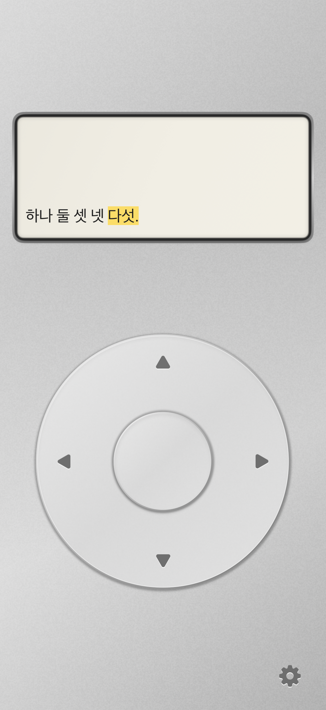

# Pocket Progressive Reader

Native iPhone behavioral prototype of a physical, fixed-focus reader. The home is a silver iPod Classic inspired instrument: inset display, ivory directional wheel, one settings entry. Settings use a plain iOS Form.

## Product context

Read [HANDOFF.md](HANDOFF.md) first. Its historical desktop lab and userscript are preserved as references. Current owner decisions supersede its PWA suggestion: SwiftUI, home + settings only, no title/library/session dashboard. The approved visual target is [docs/design/approved-home.png](docs/design/approved-home.png).

## Build

- Xcode with an iOS simulator; minimum iOS 17.
- Open `PocketReader.xcodeproj`, choose the `PocketReader` scheme and an iPhone simulator, then Run.
- Project generation (only needed after modifying project.yml): `xcodegen generate`.
- Physical device: select your own development team in Xcode Signing & Capabilities, connect and trust the iPhone, enable Developer Mode if prompted, then Run. Team IDs/profiles are not committed.

No backend, account or analytics. Markdown scripts are bundled locally; remote images load only after a tap.

## Reading

Open the app and read immediately. Tap the wheel left/right for chunks, up/down for adjacent sentence starts, or drag clockwise/counterclockwise on the ring to focus one eojeol/word per 15° detent. The first ring movement activates fine focus; it traverses continuously across reveals. Direction buttons clear it. The center is intentionally inert. The gear opens a plain utility settings sheet.

Settings accept pasted plain text/Markdown or TXT/MD files through a fixed-height source editor, three display modes and four segmentation modes, six panel references, font/spacing/history adjustments and optional progress/haptics. Text draft changes require Apply. Current Only is vertically centered. Accumulated past keeps rows stationary during CCW regression until the top boundary is crossed, with all past rows at full contrast. Full displays a naturally wrapped scrollable document; horizontal presentation displays the whole document on one unwrapped line. Full/horizontal apply Markdown formatting. Progressive chunks remain normalized plain text. Reveals are left-aligned. Word Focus Settings compare yellow background, text color, underline, dim others and high contrast without moving text. There is no activation toggle or timed progression. Reading position and settings persist locally. Reading keeps the screen awake; opening settings or leaving the app restores normal idle behavior.

The default is a fit preview. Enable actual-size mode and match its 50mm ruler with a physical ruler to approximate panel dimensions. A panel too wide for the phone is explicitly marked as scaled. No eye tracking or comprehension claims are implied.

## Tests and evidence

Run Product → Test in Xcode, or:

```sh
xcodebuild -project PocketReader.xcodeproj -scheme PocketReader \
  -destination 'platform=iOS Simulator,name=iPhone 17' \
  -parallel-testing-enabled NO test
```

See the [latest whole-document revision](docs/FULL_DOCUMENT_REVISION.md), [implementation decisions](docs/IMPLEMENTATION.md) and [verification](docs/VERIFICATION.md). Tests use an isolated sample and temporary storage, never real reading data.



See verification for the latest test counts and what remains untested on physical hardware. The standalone v4 lab also supports the revised reading experiment; run its engine checks with `node tests/web-reader.test.mjs`.

## Physical iPhone installation

The whole-document and viewport revision was built as signed Release, installed and launched successfully on the connected iPhone 13 mini on 2026-10-07. For subsequent local installation, select your development team under Signing & Capabilities, connect/unlock/trust the iPhone, choose it as the destination and Run. No team ID or signing profile is committed. Hands-on haptic, grip and ruler calibration checks remain.

## Scope

No App Store/TestFlight distribution, analytics, session evaluation, library, network service, PDF/EPUB, or hardware purchase. Future work should preserve the minimal home and experimentally separate attention effects from control feel.
